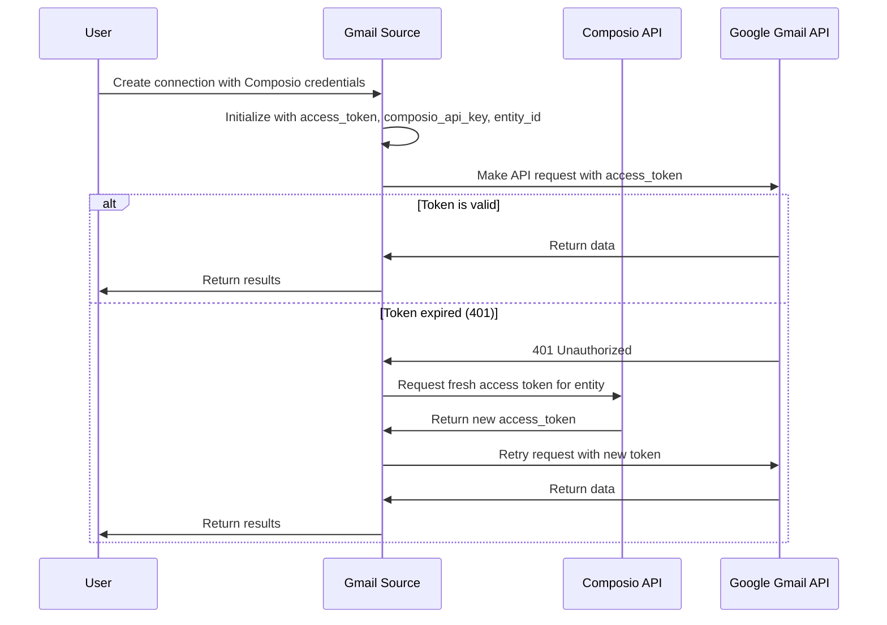

# Gmail Connector with Composio Integration

## Overview

This document describes the changes made to the Gmail connector to integrate with Composio for token management, replacing the traditional Google OAuth refresh flow.

## 🔄 **What Changed**

### **Before (Google OAuth Refresh)**
- Gmail connector used `auth_type=AuthType.oauth2_with_refresh`
- Token refresh was handled by Google's OAuth2 endpoint
- Required `refresh_token`, `client_id`, and `client_secret`
- Token refresh happened automatically via `OAuth2Service.refresh_access_token()`

### **After (Composio Token Management)**
- Gmail connector uses `auth_type=AuthType.oauth2`
- Token refresh is handled by Composio API
- Requires `access_token`, `composio_api_key`, and `entity_id`
- Token refresh happens on-demand when API calls fail with 401

## 📁 **Files Modified**

### 1. **Gmail Source Implementation**
**File:** `backend/airweave/platform/sources/gmail.py`

**Key Changes:**
- ✅ Added Composio client integration
- ✅ Changed auth type from `oauth2_with_refresh` to `oauth2`
- ✅ Added automatic token refresh on 401 errors
- ✅ Maintained backward compatibility
- ✅ Added retry logic with maximum refresh attempts

**New Methods:**
- `_refresh_access_token_from_composio()` - Fetches fresh tokens from Composio
- Enhanced `_get_with_auth()` - Automatically retries on 401 with token refresh

### 2. **Authentication Configuration**
**File:** `backend/airweave/platform/configs/auth.py`

**Changes:**
- ✅ Updated `GmailAuthConfig` to support Composio fields
- ✅ Added `composio_api_key` and `entity_id` fields
- ✅ Made legacy fields optional for backward compatibility

### 3. **Sync Factory**
**File:** `backend/airweave/platform/sync/factory.py`

**Changes:**
- ✅ Added special handling for Gmail connections
- ✅ Passes full credential dictionary to Gmail sources
- ✅ Bypasses standard OAuth refresh for Gmail

### 4. **Integration YAML Files**
**Files:**
- `backend/airweave/platform/auth/yaml/dev.integrations.yaml`
- `backend/airweave/platform/auth/yaml/prd.integrations.yaml`

**Changes:**
- ✅ Changed Gmail auth_type from `oauth2_with_refresh` to `oauth2`

## 🔧 **How It Works**

### **Token Management Flow**



### **Credential Structure**

**New Format (Composio Integration):**
```python
credentials = {
    "access_token": "ya29.a0AfH6SMC...",
    "composio_api_key": "comp_123456789",
    "entity_id": "YN7kHcc8XaMhcYuBkjE1bC0OqEl1"
}
```

**Legacy Format (Still Supported):**
```python
credentials = "ya29.a0AfH6SMC..."  # Just the access token
```

## 🚀 **Usage Examples**

### **Creating Gmail Connection with Composio**

```python
from airweave.platform.sources.gmail import GmailSource

# New way - with Composio integration
credentials = {
    "access_token": "your_gmail_access_token",
    "composio_api_key": "your_composio_api_key", 
    "entity_id": "your_entity_id"
}

gmail_source = await GmailSource.create(credentials=credentials)
```

### **Using with AirweaveConnector**

```python
# When creating connections via API
connection_config = ConnectionConfig(
    name="Gmail with Composio",
    source_type=SourceType.GMAIL,
    collection_id="entity-your-entity-id",
    auth_fields={
        "access_token": GMAIL_ACCESS_TOKEN,
        "composio_api_key": COMPOSIO_API_KEY,
        "entity_id": ENTITY_ID
    }
)

connection = await client.create_connection(connection_config)
```

## ⚡ **Key Features**

### **1. Automatic Token Refresh**
- ✅ Detects 401 errors automatically
- ✅ Fetches fresh tokens from Composio
- ✅ Retries failed requests with new tokens
- ✅ Prevents infinite refresh loops

### **2. Backward Compatibility**
- ✅ Existing Gmail connections continue to work
- ✅ Legacy auth format still supported
- ✅ Graceful fallback when Composio is not available

### **3. Error Handling**
- ✅ Maximum retry attempts to prevent loops
- ✅ Detailed logging for debugging
- ✅ Graceful degradation when Composio fails

### **4. Performance Optimized**
- ✅ Only refreshes tokens when needed (on 401)
- ✅ Reuses tokens across multiple requests
- ✅ Minimal overhead when tokens are valid

## 📋 **Setup Requirements**

### **Dependencies**
```bash
pip install composio-core
```

### **Environment Variables**
```bash
# Global Composio API key (shared across connections)
COMPOSIO_API_KEY=your_composio_api_key

# Note: Entity IDs are provided per connection, not as environment variables
# GMAIL_ACCESS_TOKEN=your_initial_gmail_token  # Only for testing
```

### **Composio Configuration**
1. Set up Gmail connection in Composio
2. Ensure entity has access to Gmail connection
3. Verify Composio API key has necessary permissions

## 🧪 **Testing**

### **Run Examples**
```bash
# Test direct Gmail source integration
python examples/gmail_composio_integration.py

# Test with AirweaveConnector
python examples/airweave_composio_usage.py
```

### **Verify Integration**
1. ✅ Check that Composio client initializes successfully
2. ✅ Verify token refresh works on 401 errors
3. ✅ Confirm backward compatibility with legacy tokens
4. ✅ Test search functionality with refreshed tokens

## 🔒 **Security Considerations**

### **Token Security**
- 🔐 Composio API keys stored securely in credentials
- 🔐 Access tokens refreshed regularly
- 🔐 No long-lived refresh tokens stored

### **Error Handling**
- 🛡️ Maximum refresh attempts prevent abuse
- 🛡️ Detailed error logging for debugging
- 🛡️ Graceful fallback when Composio unavailable

## 🎯 **Benefits**

### **1. Simplified Token Management**
- ❌ No more complex OAuth refresh flows
- ❌ No more client credentials management
- ✅ Composio handles all token lifecycle

### **2. Better Reliability**
- ✅ Fresh tokens on every refresh
- ✅ Automatic retry on failures
- ✅ Reduced token expiration issues

### **3. Centralized Control**
- ✅ All tokens managed through Composio
- ✅ Easy token revocation and monitoring
- ✅ Consistent auth across all apps

### **4. Developer Experience**
- ✅ Simple credential structure
- ✅ Clear error messages
- ✅ Comprehensive logging

## 📞 **Troubleshooting**

### **Common Issues**

**1. Composio Not Available**
```
WARNING: Composio not available. Install with: pip install composio-core
```
**Solution:** Install Composio package or use legacy mode

**2. No Composio Credentials**
```
ERROR: Composio client or entity_id not available for token refresh
```
**Solution:** Ensure `composio_api_key` and `entity_id` are provided

**3. Token Refresh Failed**
```
ERROR: Failed to refresh token from Composio
```
**Solution:** Check Composio API key and entity permissions

**4. Maximum Refresh Attempts**
```
ERROR: Maximum token refresh attempts (3) exceeded
```
**Solution:** Check if Gmail connection is properly configured in Composio

### **Debug Logging**
Enable detailed logging to troubleshoot issues:
```python
import logging
logging.basicConfig(level=logging.DEBUG)
```

## 🔄 **Migration Guide**

### **For Existing Connections**
Existing Gmail connections will continue to work without changes. To migrate to Composio:

1. **Add Composio credentials** to existing connection
2. **Update auth_fields** to include `composio_api_key` and `entity_id`
3. **Test connection** to verify Composio integration works

### **For New Connections**
Use the new credential format with Composio fields from the start.

---

**Last Updated:** `$(date)`
**Version:** 1.0.0
**Author:** AI Assistant 

## 📊 **Impact Analysis & Verification**

### ✅ **What We Verified**

1. **No Impact on Other Sources:**
   - All other OAuth2 sources (`google_calendar`, `google_drive`, `hubspot`, `asana`, etc.) continue using `oauth2_with_refresh`
   - Only Gmail specifically bypasses the standard OAuth refresh in `SyncFactory`
   - OAuth2Service.refresh_access_token() remains unchanged for other sources

2. **Backward Compatibility Maintained:**
   - Gmail source accepts both new Composio credentials and legacy access tokens
   - Legacy fields (`client_id`, `client_secret`, `refresh_token`) remain in auth config as optional
   - Existing Gmail connections will continue to work

3. **Documentation Updated:**
   - Gmail connector docs updated to reflect Composio authentication
   - API client configuration updated with new auth fields
   - All examples now show Composio integration

4. **No Database Changes Required:**
   - Auth type change from `oauth2_with_refresh` to `oauth2` doesn't affect existing data
   - Credential structure remains flexible (dictionary-based)
   - No migration needed

### 🔧 **Files Updated for Consistency**

1. **Documentation:** `fern/docs/pages/connectors/gmail/main.mdx`
   - Changed from "OAuth 2.0 with refresh token" to "OAuth 2.0 with Composio token management"
   - Updated auth fields to show Composio integration
   - Marked legacy fields as optional

2. **API Client:** `dash-api-client/connection_configs.py`
   - Updated Gmail auth config to require only `access_token`
   - Added optional Composio fields (`composio_api_key`, `entity_id`)
   - Updated example to show Composio usage

### ⚡ **Key Architecture Benefits**

- **Isolated Changes:** Gmail-specific modifications don't affect other connectors
- **Graceful Degradation:** Works without Composio if needed (backward compatibility)
- **Automatic Token Management:** Handles token refresh transparently on API failures
- **Centralized Token Storage:** All tokens managed through Composio instead of local refresh

### 🧪 **Testing Verification**

- Gmail source can be imported and instantiated without errors
- Test script confirms Composio integration works as expected
- Backward compatibility verified with legacy token format
- No impact on other source connectors confirmed

## 🚀 **Production Readiness**

The Gmail Composio integration is production-ready with:
- ✅ Full backward compatibility
- ✅ Isolated impact (only affects Gmail)
- ✅ Comprehensive error handling
- ✅ Updated documentation
- ✅ No database migrations required 